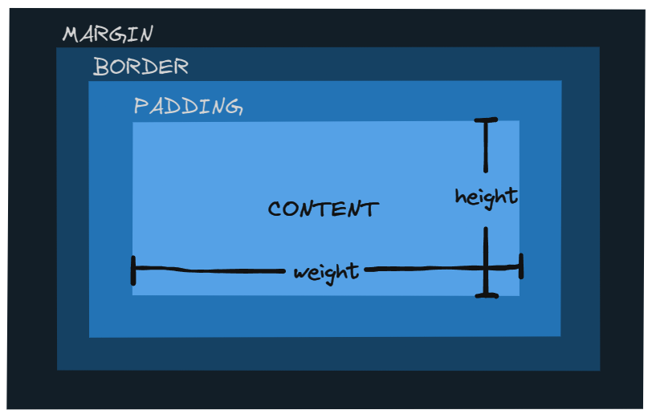

# 🖌 **CSS BÁSICO** 🖌

---

## **Selectores Básicos**

Los selectores son la forma de seleccionar uno o varios elementos para aplicar estilos. Algunos de los más comunes son:

| Selector                | Descrición                                                                                                        |
| ----------------------- | ----------------------------------------------------------------------------------------------------------------- |
| `*`                     | **Selector Universal**: Selecciona todos los elementos del documento.                                             |
| `etiqueta`              | **Selector de Tipo**: Selecciona todos los elementos de un tipo específico (por ejemplo, `div`, `p`).             |
| `.class`                | **Selector de Clase**: Selecciona todos los elementos con una clase específica.                                   |
| `#id`                   | **Selector de ID**: Selecciona un elemento único con un ID específico.                                            |
| `[atributo]`            | **Selector de Atributo**: Selecciona elementos que tienen un atributo específico.                                 |
| `etiqueta:pseudo-clase` | **Selector de Pseudo-clase**: Selecciona elementos en un estado específico (por ejemplo, `:hover`, `:nth-child`). |

---

## **Propiedades de Texto y Fuente**

Estas propiedades permiten personalizar el estilo del texto:

| Propiedad         | Descripción                                           |
| ----------------- | ----------------------------------------------------- |
| `color`           | Cambia el color del texto.                            |
| `font-family`     | Cambia el tipo de fuente.                             |
| `font-size`       | Cambia el tamaño de la fuente.                        |
| `font-weight`     | Cambia el grosor de la fuente.                        |
| `font-style`      | Cambia el estilo de la fuente (por ejemplo, cursiva). |
| `text-align`      | Alinea el texto dentro de su contenedor.              |
| `text-decoration` | Decora el texto (por ejemplo, subrayado).             |
| `text-transform`  | Transforma el texto (por ejemplo, mayúsculas).        |
| `line-height`     | Ajusta el espacio entre líneas de texto.              |
| `letter-spacing`  | Ajusta el espacio entre letras.                       |

---

## **Tipografías Externas**

Se pueden vincular tipografías externas para personalizar el diseño:

- Usar la etiqueta `<link>` con la URL correspondiente.
- Configurar con `@font-face` para mayor control.

---

## **Modelo de Caja (Box Model)**

El modelo de caja describe cómo se calculan las dimensiones de un elemento:

| Propiedad | Descripción                    |
| --------- | ------------------------------ |
| `width`   | Define el ancho del contenido. |
| `height`  | Define el alto del contenido.  |

---

## **Relleno y Margen (Padding y Margin)**

| Propiedad        | Descripción                                                                   |
| ---------------- | ----------------------------------------------------------------------------- |
| `margin`         | Define el espacio externo entre un elemento y los elementos que lo rodean.    |
| `margin-left`    | Define el espacio externo entre un elemento y los elementos a su izquierda.   |
| `margin-top`     | Define el espacio externo entre un elemento y los elementos que esten arriba. |
| `margin-right`   | Define el espacio externo entre un elemento y los elementos a su derecha.     |
| `margin-bottom`  | Define el espacio externo entre un elemento y los elementos que esten abajo.  |
| `padding`        | Define el espacio interno entre el contenido y el borde de un elemento.       |
| `padding-left`   | Define el espacio interno entre el contenido y el borde izquierdo.            |
| `padding-top`    | Define el espacio interno entre el contenido y el borde superior.             |
| `padding-right`  | Define el espacio interno entre el contenido y el borde derecho.              |
| `padding-bottom` | Define el espacio interno entre el contenido y el borde inferior.             |

---

## **Bordes**

| Propiedad       | Descripción                                                 |
| --------------- | ----------------------------------------------------------- |
| `border-width`  | Define el grosor del borde.                                 |
| `border-style`  | Define el estilo del borde (por ejemplo, sólido, punteado). |
| `border-color`  | Define el color del borde.                                  |
| `border`        | Define grosor, estilo y color en una sola propiedad.        |
| `border-radius` | Redondea las esquinas del borde.                            |

---

## **Tamaño de Caja (Box Sizing)**

- **`box-sizing`**: Controla cómo se calculan las dimensiones totales de un elemento.
  - `content-box` | Incluye solo el contenido en el tamaño definido (padding y borde se suman).
  - `border-box` | Incluye contenido, padding y borde en el tamaño definido.

---

## **Colores**

CSS permite definir colores en diferentes formatos:

| Formato                          | Descripción                                                                       |
| -------------------------------- | --------------------------------------------------------------------------------- |
| `RGB (Red Green Blue)`           | Mezcla de rojo, verde y azul. Ejemplo: `rgb(255, 0, 0)`.                          |
| `RGBA`                           | Igual que RGB, pero con opacidad. Ejemplo: `rgba(255, 0, 0, 0.5)`.                |
| `Colores Hexadecimales`          | Representación en base 16. Ejemplo: `#FF0000`.                                    |
| `HSL (Hue Saturation Lightness)` | Define colores por matiz, saturación y luminosidad. Ejemplo: `hsl(0, 100%, 50%)`. |
| `HSLA`                           | Igual que HSL, pero con opacidad. Ejemplo: `hsla(0, 100%, 50%, 0.5)`.             |

---

## **Unidades**

- **Unidades Absolutas**: No dependen de factores externos.
  - `px` (píxeles), `cm` (centímetros), `in` (pulgadas).
- **Unidades Relativas**: Dependen de un contexto.
  - `%` (porcentajes), `em` (tamaño relativo a la fuente del elemento padre), `rem` (tamaño relativo a la fuente raíz).
  - `vw` (1% del ancho del viewport), `vh` (1% de la altura del viewport).
  - `vmax` y `vmin` (máximo o mínimo entre ancho y alto del viewport).

---

## **Fondos, Gradientes y Sombras**

### Fondos

| Propiedad               | Descripción                                                    |
| ----------------------- | -------------------------------------------------------------- |
| `background-color`      | Define el color de fondo.                                      |
| `background-image`      | Especifica una imagen como fondo.                              |
| `background-size`       | Ajusta el tamaño de la imagen de fondo.                        |
| `background-position`   | Posiciona la imagen de fondo.                                  |
| `background-repeat`     | Controla si la imagen de fondo se repite.                      |
| `background-attachment` | Define si el fondo es fijo o se desplaza.                      |
| `background`            | Propiedad abreviada para definir múltiples aspectos del fondo. |

### Gradientes

| Propiedad         | Descripción                                     |
| ----------------- | ----------------------------------------------- |
| `linear-gradient` | Gradiente lineal en una dirección específica.   |
| `radial-gradient` | Gradiente radial desde un punto central.        |
| `conic-gradient`  | Gradiente cónico alrededor de un punto central. |

### Sombras

| Propiedad     | Descripción                             |
| ------------- | --------------------------------------- |
| `box-shadow`  | Agrega sombras a los elementos.         |
| `text-shadow` | Agrega sombras al texto.                |
| `drop-shadow` | Aplica sombras proyectadas a elementos. |

---
